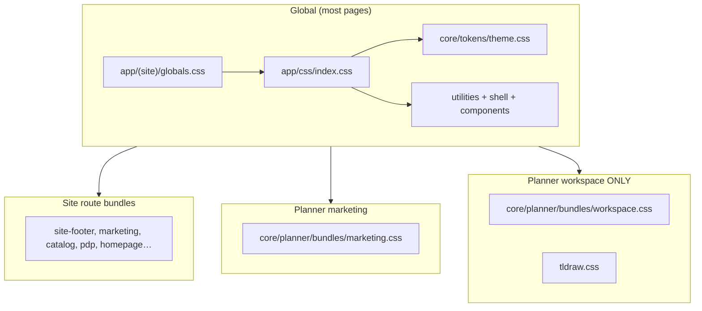

# CSS Architecture — how it works today

*2026-06-15 — updated after Phase 4 + Step 6 migration, homepage/planner typography pass.*

---

## 1. The one sentence version

**Global core tokens and shared primitives load once via `globals.css`. Route-specific CSS is imported per layout or page — site bundles, planner marketing, and planner workspace are separate.**

---

## 2. How CSS loads today

### Step A — every surface starts here

```
app/(site)/globals.css
    └── imports app/css/index.css   ← core bundle (tokens, utilities, shell, components)
```

These layouts pull in `globals.css`:

| Area | Layout file |
|---|---|
| Marketing site (`/`, `/products`, …) | `app/(site)/layout.tsx` |
| Planner (`/planner/*`) | `app/planner/layout.tsx` |
| CRM | `app/crm/layout.tsx` |
| Ops | `app/ops/layout.tsx` |

### Step B — what is inside `app/css/index.css`

```
app/css/index.css
├── core/tokens/theme.css       ← colors, spacing, buddy aliases
├── core/typography/type.css    ← typ-h1, home-heading, etc.
├── core/utilities/*            ← buttons, colors, layout helpers
├── core/layout/*               ← app-shell, marketing layout
├── core/chrome/shell/*         ← footer, nav, workspace shell, admin
├── base/animations.css         ← global motion primitives
└── core/components/*           ← cards, stats, nav (FOCSS components)
```

**Legacy `routes/legacy/*` is gone.** Per-route CSS is no longer in the global bundle.

### Step C — route bundles (imported by layouts/pages)

| Bundle | Imported from |
|---|---|
| `core/site/bundles/site-footer.css` | `app/(site)/layout.tsx` |
| `core/site/bundles/site-contact.css` | `app/(site)/layout.tsx` |
| `core/site/bundles/marketing.css` | `app/(site)/layout.tsx`, `app/planner/layout.tsx` |
| `core/site/bundles/site-error.css` | `app/(site)/layout.tsx` |
| `core/site/bundles/homepage.css` | `app/(site)/page.tsx` |
| `core/site/bundles/catalog.css` | `app/(site)/products/layout.tsx` |
| `core/site/bundles/pdp.css` | `app/(site)/products/layout.tsx` |
| `core/site/bundles/legal.css` | `app/(site)/privacy/page.tsx` |
| `core/planner/bundles/marketing.css` | `app/planner/layout.tsx` |
| `core/planner/bundles/workspace.css` | `app/planner/(workspace)/layout.tsx` |

### Step D — homepage bundle chain

`core/site/bundles/homepage.css` is imported only from `app/(site)/page.tsx`. It pulls route-level home CSS in order:

```
homepage.css
├── routes/home/base.css      ← hero layout, scrim, home-hero-title-homepage (import first)
├── routes/home/sections.css
├── routes/home/showcase.css
├── routes/home/projects.css
└── routes/home/extras.css
```

If `base.css` is missing from this chain, the homepage hero and section shells lose layout/contrast rules.

### Step E — planner workspace bundle chain

```1:9:app/css/core/planner/bundles/workspace.css
@import "../planner-shell.css";
@import "../planner-workflow.css";
@import "../planner-controls.css";
@import "../planner-overlays.css";
@import "../planner-catalog.css";
@import "../planner-responsive.css";
@import "../workspace.css";
@import "../editor-chrome.css";
@import "../planner-typography.css";
```

`planner-shell.css` sets `.planner-workspace` typography scale (`--pw-text-*`) and maps legacy `--planner-*` tokens to site theme vars. `planner-workflow.css` styles `.pw-step-bar` and `.pw-workflow-panel` (right-rail “Current step” UI). `planner-typography.css` is imported **last** so workspace copy rules win over shell defaults.

Layout also loads tldraw:

```3:4:app/planner/(workspace)/layout.tsx
import "@/app/css/core/planner/bundles/workspace.css";
import "tldraw/tldraw.css";
```

Planner **marketing** routes (`/planner`, `/planner/guest` onboarding) load marketing CSS only — not editor chrome, workflow panel, or tldraw.

---

## 3. Visual map (today)



---

## 4. Folder layout

```
app/css/
├── index.css              ← global core entry (imported by globals.css)
├── base/
│   └── animations.css     ← motion primitives at css root
└── core/
    ├── tokens/theme.css   ← single @theme source (incl. buddy + planner accent)
    ├── typography/
    ├── utilities/
    ├── layout/
    ├── chrome/shell/
    ├── components/
    ├── site/
    │   ├── bundles/       ← marketing site route CSS (homepage.css, catalog.css, …)
    │   └── routes/home/   ← homepage section CSS (imported via homepage.css)
    └── planner/
        ├── bundles/       ← marketing.css + workspace.css
        ├── planner-shell.css
        ├── planner-workflow.css
        ├── planner-typography.css
        └── workspace.css  ← canvas-only rules (no duplicate @theme)
```

---

## 5. Two files named `workspace.css`

| File | Purpose |
|---|---|
| `app/css/core/chrome/shell/workspace.css` | CRM / ops dashboard (`.shell-workspace-*`) |
| `app/css/core/planner/workspace.css` | Planner canvas rules (imported via workspace bundle) |

Same name, different jobs. Edit the wrong one and nothing fixes.

---

## 6. Planner accent override

Buddy tokens (`--color-paper`, `--color-blueprint`, …) live in `core/tokens/theme.css`. Planner workspace accent is scoped:

```css
body.planner-workspace { /* accent overrides */ }
```

Duplicate `@theme` blocks were removed from `planner/workspace.css` (Step 6, 2026-06-14).

---

## 7. Site typography defaults (2026-06-15)

`core/typography/type.css` sets default text colors on shared utilities (`typ-section`, `typ-h2`, `typ-h3`, `typ-body`, etc.) so sections do not inherit faint muted text. Muted/subtle steps were darkened in `core/tokens/theme.css` (`--text-muted`, `--text-subtle`).

Homepage hero uses `home-hero-title-homepage` from `routes/home/base.css` — not raw `typ-h1` — to avoid global display-size clashes on the hero scrim.

---

## 8. Rules

1. **No new CSS in deleted `routes/legacy/`** — use `core/site/bundles/` or `core/planner/`.
2. **No hex in component CSS** — use `var(--surface-page)`, not `#fff`.
3. **No `import ".css"` in components** — layout or page owns the import.
4. **Planner marketing ≠ planner workspace** — separate layout trees and bundles.

---

## 9. Phase status

| Phase | Status |
|---|---|
| 1 — Remove legacy from global bundle | Done |
| 2 — Port legacy rules to route bundles | Done |
| 3 — Per-route layout imports | Done |
| 4 — Planner marketing vs workspace split | Done |
| 5 — Hardcoding sweep (TS + CSS tokens) | In progress — site + planner typography largely tokenized; FilterGrid structural split pending |
| 6 — Merge workspace `@theme` into theme.css | Done |

---

## 10. Quick reference

| I want to… | File |
|---|---|
| Change brand colors | `app/css/core/tokens/theme.css` |
| Style homepage | `app/css/core/site/bundles/homepage.css` → `routes/home/base.css` |
| Style product catalog | `app/css/core/site/bundles/catalog.css` |
| Style planner panels / workflow step bar | `app/css/core/planner/planner-workflow.css` (via workspace bundle) |
| Style planner workspace typography | `app/css/core/planner/planner-typography.css` (imported last in bundle) |
| Style planner shell / `--planner-*` aliases | `app/css/core/planner/planner-shell.css` |
| Style planner landing | `app/css/core/planner/bundles/marketing.css` |
| Fix canvas dark mode | `body.planner-workspace` rules in `theme.css` + workspace bundle |

---

## 11. Glossary

| Term | Meaning |
|---|---|
| **FOCSS** | Furniture Oando CSS System — token + component approach |
| **`@theme`** | Tailwind v4 design token block |
| **`globals.css`** | First CSS Next loads for a layout tree |
| **`.pw-*`** | Planner workspace class prefix |
| **`typ-*`** | Typography utilities (`typ-h1`, `typ-eyebrow`, …) |

For operating rules see `Readme.md` and `AGENTS.md`. For open issues see `docs/Failures.md`.