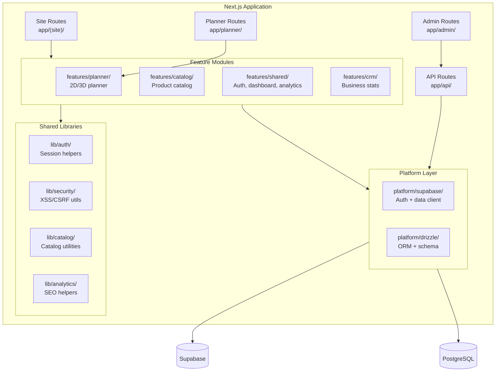

# Component Architecture

## C4 Container Diagram

## Feature Modules

### features/planner/

The planner is the core product — a dual-mode 2D/3D workspace design tool.

**Sub-modules:**
- `canvas-fabric/` — Fabric.js 2D canvas (FloorplanCanvas, RoomPresetsModal)
- `3d/` — Three.js 3D viewer (Planner3DViewer, viewerMaterials)
- `editor/` — Workspace shell (PlannerWorkspace, PlannerLeftPanel, inspector)
- `store/` — Zustand stores (plannerStore, plannerUIStore, workspaceStore)
- `persistence/` — Draft/save/cloud sync (plannerDraft, plannerSaves, cloudPlanHydration)
- `catalog/` — Planner-specific catalog (shapeTypeRegistry, placementCatalogResolver)
- `model/` — Document model (plannerDocument, plannerManagedProduct)
- `lib/` — Utilities (featureFlags, measurements, fabricDocumentBridge)
- `hooks/` — React hooks (usePlannerSession, usePlannerFabricAutosave)

**Architecture:** Zustand drives state → Fabric renders 2D → document model feeds 3D viewer via React Three Fiber.

### features/catalog/

Product catalog with hierarchical categories, filtering, and image management.

**Key files:**
- `categories.ts` — Category tree, labels, descriptions
- `imageMetadata.ts` — Image asset metadata and resolution
- `getProducts.ts` — Product fetching and normalization

### features/shared/

Cross-feature modules shared between planner, configurator, and site.

**Sub-modules:**
- `auth/` — AuthProvider, LoginPage, SignupPage, session types
- `dashboard/` — DashboardClient for authenticated user views
- `analytics/` — KPI tracking types and event definitions

## Platform Layer

### platform/supabase/

Supabase client configuration for browser and server contexts.

- `client.ts` — Browser client (createBrowserClient)
- `server.ts` — SSR client (createServerClient with cookie handling)
- `auth-admin.ts` — Admin client for server-side auth operations
- `env.ts` — Environment variable validation
- `safe.ts` — Retry wrapper for Supabase operations

### platform/drizzle/

Drizzle ORM for direct PostgreSQL access (DigitalOcean managed DB).

- `schema.ts` — Table definitions (profiles, plans, teams, audit_events)
- `db.ts` — Connection pooling with lazy initialization

## API Layer

Route groups:
- `app/api/plans/` — Plan CRUD operations
- `app/api/admin/catalog/` — Catalog management (3 variants: standard, buddy, configurator)
- `app/api/customer-queries/` — Customer inquiry submission
- `app/api/recommendations/` — AI-powered product recommendations
- `app/api/tracking/` — Analytics event tracking
- `app/api/audit/` — Audit trail logging
- `app/api/ai-advisor/` — AI layout assistance
