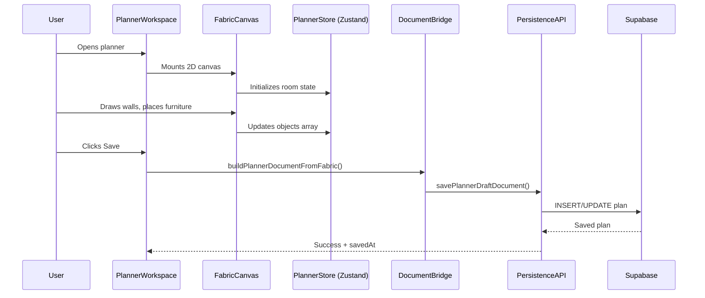
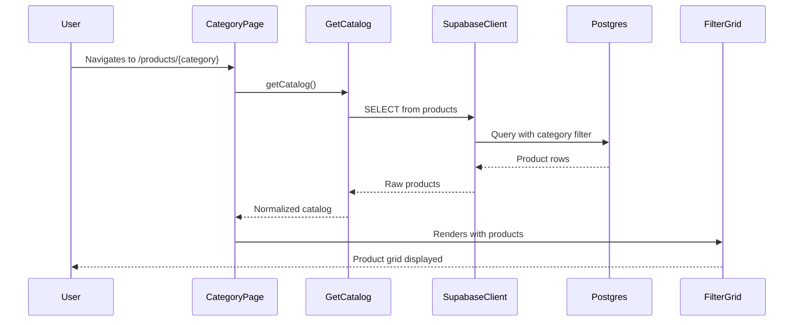
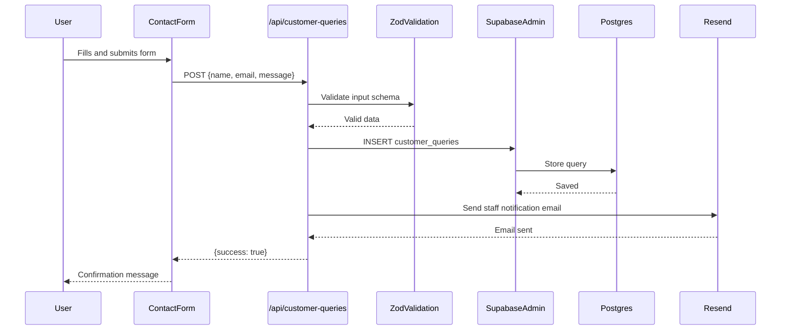
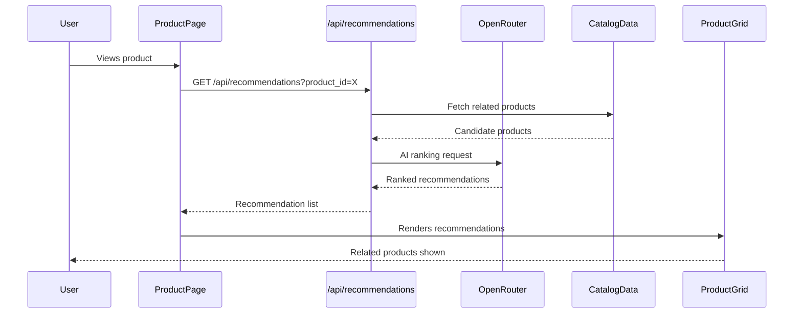
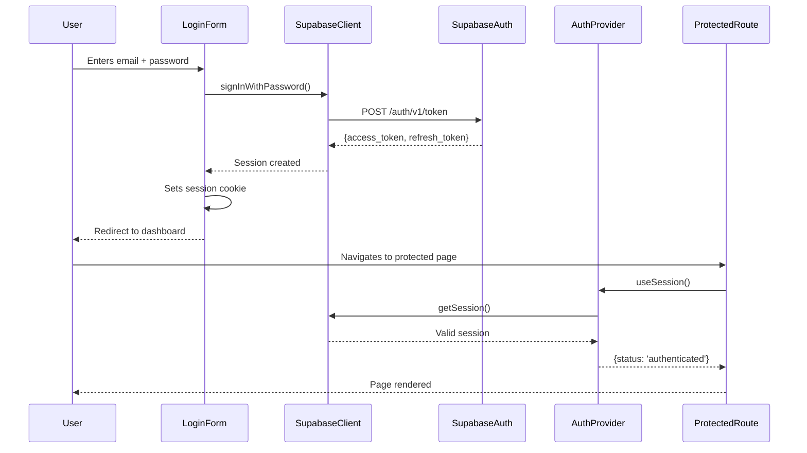
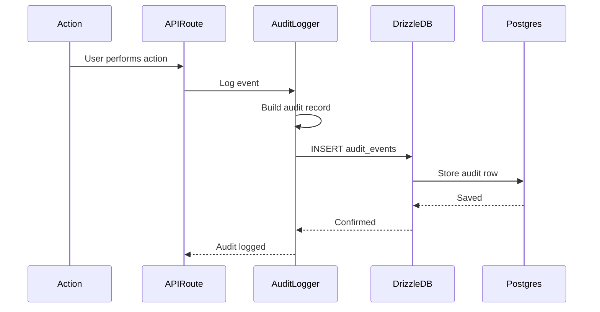
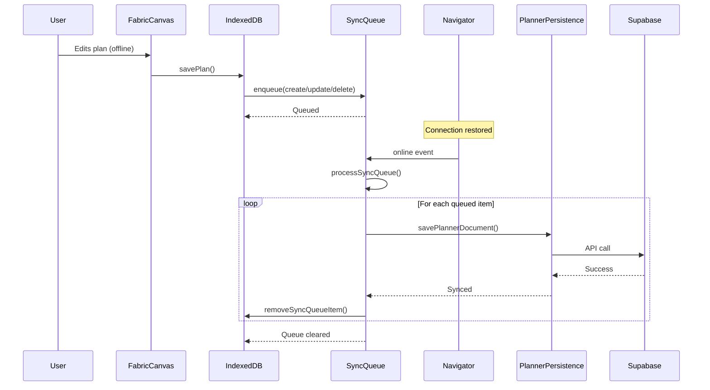

# Data Flow Diagrams

## 1. Plan Creation Flow

## 2. Product Catalog Query Flow

## 3. Customer Query Submission Flow

## 4. Recommendation Engine Flow

## 5. Authentication Flow

## 6. Audit Logging Flow

## 7. Offline-First Sync Flow (Planner)

## Data Validation Layers

1. **Client-side**: React form validation, Zod schemas in components
2. **API boundary**: Zod schema validation in route handlers
3. **Database**: PostgreSQL constraints, Drizzle schema types
4. **Supabase RLS**: Row-level security policies

## Error Handling Patterns

- **API routes**: Try/catch with standardized error responses
- **Supabase queries**: `fetchWithSupabaseRetry` with exponential backoff
- **Canvas operations**: Error boundaries around Fabric/Three.js components
- **Offline sync**: Retry queue with max 3 attempts, conflict detection
