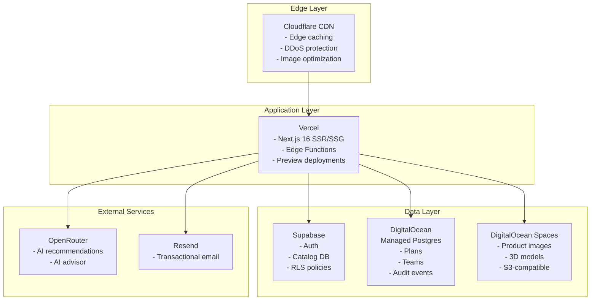
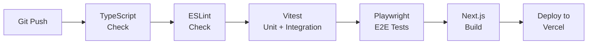

# Deployment Architecture

## Deployment Topology



## Vercel Configuration

**Build settings:**
- Framework: Next.js 16
- Build command: `npm run build`
- Output directory: `.next`
- Node.js version: 20+

**Environment variables (production):**
- `NEXT_PUBLIC_SUPABASE_URL` — Supabase project URL
- `NEXT_PUBLIC_SUPABASE_ANON_KEY` — Supabase anonymous key
- `SUPABASE_ADMIN_SERVICE_ROLE_KEY` — Server-side service role
- `NEXT_ADMIN_SUPABASE_URL` — Admin Supabase URL
- `DATABASE_URL` — DigitalOcean Postgres connection string
- `ORIGIN_ENDPOINT` — DigitalOcean Spaces CDN
- `OPENROUTER_API_KEY_PRIMARY` and `OPENROUTER_API_KEY_BACKUP` — AI model access
- `RESEND_API_KEY` — Email sending

## Self-Hosted Configuration

For non-Vercel deployments:

```bash
# Build
npm ci
npm run build

# Start
npm start

# Or with custom port
PORT=3000 npm start
```

**Requirements:**
- Node.js 20+
- PostgreSQL 15+ (for Drizzle tables)
- Supabase project (for auth + catalog)
- S3-compatible storage (for assets)

## CI/CD Pipeline



**Quality gates:**
- `npm run typecheck` — Zero TypeScript errors
- `npm run lint` — Zero ESLint warnings
- `npm run test` — All unit/integration tests pass
- `npm run test:e2e` — Playwright E2E tests pass
- `npm run build` — Production build succeeds

## Database Management

### Supabase (Auth + Catalog)

- Migrations: `platform/supabase/migrations/`
- Applied via: Supabase CLI or dashboard
- RLS policies enforced on all tables

### DigitalOcean Postgres (Drizzle)

- Schema: `platform/drizzle/schema.ts`
- Tables: profiles, plans, teams, team_members, invites, audit_events
- Connection: Via `DATABASE_URL` environment variable
- Pooling: Lazy initialization with Proxy pattern

## Monitoring

- **Vercel Analytics**: Core Web Vitals, page speed
- **Supabase Dashboard**: Auth events, query performance
- **DigitalOcean**: Database metrics, connection pooling
- **Cloudflare**: Traffic analytics, security events

## Security

- All secrets in environment variables (never committed)
- Supabase RLS for row-level data access
- CSRF protection on mutation routes
- XSS sanitization on all JSON-LD injection
- HttpOnly secure cookies for sessions
- Rate limiting on public API endpoints

## Scaling Considerations

- **Static pages**: ISR with revalidation for product pages
- **API routes**: Serverless functions (auto-scaling on Vercel)
- **Database**: Connection pooling via Supabase PgBouncer
- **Assets**: CDN-distributed via Cloudflare + DigitalOcean Spaces
- **3D/Canvas**: Client-side only, no server impact

## Disaster Recovery

- **Supabase**: Automated daily backups, point-in-time recovery
- **DigitalOcean Postgres**: Automated backups with 7-day retention
- **DigitalOcean Spaces**: Versioning enabled, cross-region replication
- **Vercel**: Deployment rollback via dashboard or CLI
