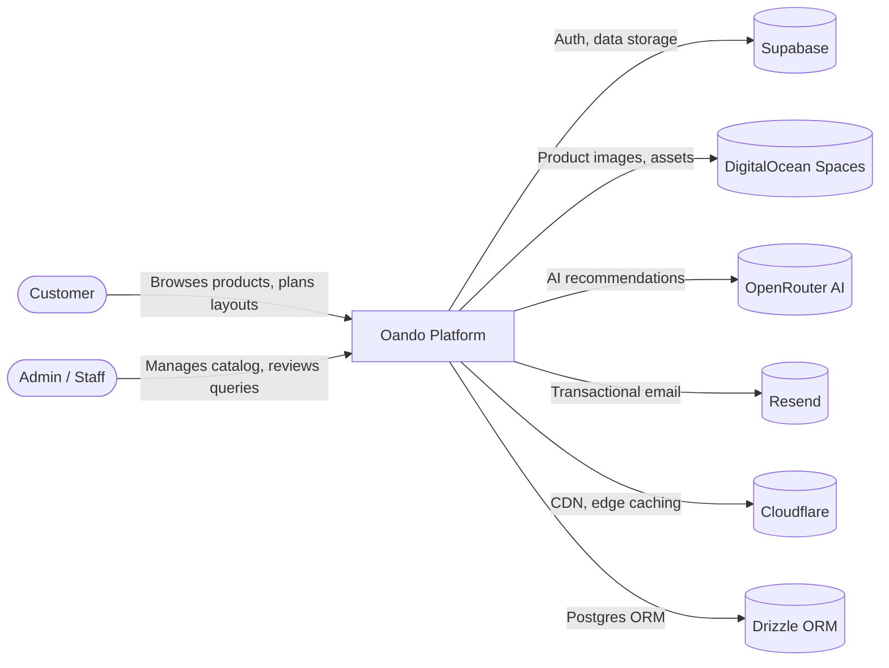

# System Overview — Oando Platform

## System Purpose

The Oando Platform is a modular furniture workspace planner and product catalog suite. It enables customers to design office layouts in 2D/3D, browse product catalogs, and submit inquiries — all within a unified Next.js application.

## C4 Context Diagram

## Core Capabilities

1. **Workspace Planner** — 2D Fabric.js canvas + 3D Three.js viewer for office layout design
2. **Product Catalog** — Hierarchical product browsing with filtering, search, and recommendations
3. **Configurator** — Product variant selection with real-time 3D preview
4. **CRM Dashboard** — Customer query management, business stats, audit trails
5. **AI Advisor** — AI-powered product recommendations and layout assistance

## Technology Stack

| Layer | Technology |
|-------|-----------|
| Framework | Next.js 16 (App Router) |
| UI | React 19, Tailwind CSS 4 |
| State | Zustand 5 (15+ stores) |
| 2D Canvas | Fabric.js 7 |
| 3D | Three.js 0.184, React Three Fiber |
| Database | PostgreSQL (DigitalOcean) |
| ORM | Drizzle 0.45 |
| Auth | Supabase Auth |
| Storage | DigitalOcean Spaces (S3) |
| AI | OpenRouter (multi-model) |
| Email | Resend |
| CDN | Cloudflare |
| Testing | Vitest + Playwright |

## Security Considerations

- Supabase RLS for data access control
- CSRF protection via double-submit cookie pattern
- XSS prevention via JSON-LD sanitization
- Rate limiting on public API routes
- HttpOnly secure cookies for session management

## Performance Characteristics

- Static generation for product pages (ISR)
- Dynamic imports for heavy 3D/canvas bundles
- IndexedDB offline storage for planner drafts
- Sync queue with retry for offline-first experience

## Integration Points

- **Supabase**: Auth, catalog data, customer queries, plans storage
- **DigitalOcean Spaces**: Product images, 3D models, CDN assets
- **OpenRouter**: AI advisor, product recommendations
- **Resend**: Transactional emails, staff notifications
- **Cloudflare**: Edge caching, DDoS protection, image optimization
