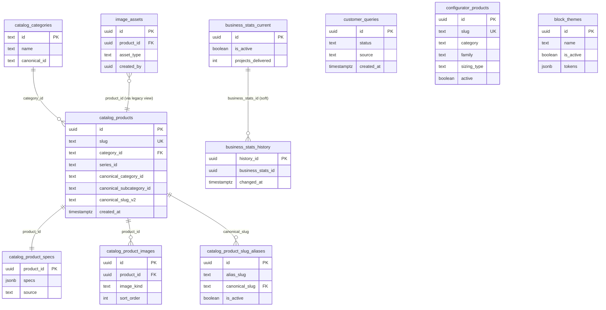
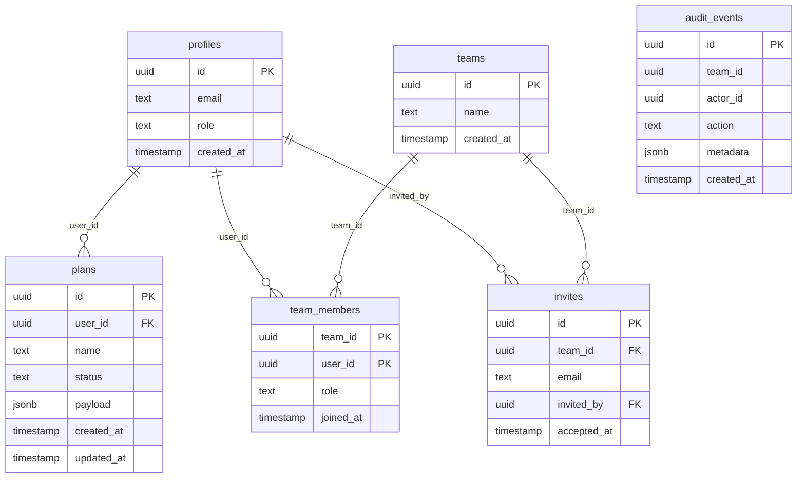

# Database Schema

Documentation of all tables, relationships, indexes, and Row-Level Security (RLS) policies across the two Postgres databases backing the Oando Platform.

> **Two databases** — the platform split its data across two managed Postgres instances:
> - **Products DB** (Supabase, `PRODUCTS_DATABASE_URL`) — public marketing catalog, business stats, customer queries, image assets, configurator, block themes. Migrations live in `platform/supabase/migrations/`.
> - **Admin/Planner DB** (DigitalOcean, `DATABASE_URL`) — planner plans, teams, invites, audit events, profiles. Schema defined in `platform/drizzle/schema.ts`; migrations in `platform/drizzle/migrations/`.

---

## Products DB

### `catalog_products`

The product marketing catalog. Renamed from `products` by `20260307153500`; a `SECURITY INVOKER` view named `products` preserves legacy reads.

| Column | Type | Notes |
|---|---|---|
| `id` | uuid PK | `gen_random_uuid()` |
| `name` | text | not null |
| `slug` | text | unique, not null |
| `category` | text | legacy category label |
| `category_id` | text | FK → `catalog_categories(id)` |
| `performance_tier` | text | |
| `flagship_image` | text | |
| `images` | jsonb | gallery array |
| `scene_images` | text[] | |
| `variants` | jsonb | |
| `detailed_info` | jsonb | |
| `metadata` | jsonb | carries `subcategoryLabel`, `subcategoryId`, canonical IDs |
| `specs` | jsonb | (legacy; canonical copy in `catalog_product_specs`) |
| `3d_model` | text | |
| `series_id` | text | |
| `series_name` | text | |
| `normalized_name_key` | text | set by trigger `trg_set_products_normalized_name_key` |
| `canonical_category_id` | text | set by trigger `trg_set_product_canonical_fields` |
| `canonical_subcategory_id` | text | same trigger |
| `canonical_subcategory_label` | text | same trigger |
| `canonical_slug_v2` | text | same trigger |
| `canonical_series_id` | text | same trigger |
| `created_at` | timestamptz | default `now()` |

**Indexes**
- `products_slug_key` (unique, from constraint) — slug lookups
- `idx_catalog_products_category` — category filter
- `idx_catalog_products_category_id` — FK lookups
- `idx_catalog_products_category_normalized_name_key` — (category_id, normalized_name_key)
- `idx_catalog_products_canonical_category_id`
- `idx_catalog_products_canonical_subcategory_id`
- `idx_catalog_products_canonical_slug_v2`
- `idx_catalog_products_created_at` — newest-first lists *(added 2026-06-20)*
- `idx_catalog_products_series_id` *(added 2026-06-20)*
- `idx_catalog_products_series_name` *(added 2026-06-20)*
- `idx_catalog_products_performance_tier` (partial: not null) *(added 2026-06-20)*
- `idx_catalog_products_category_created_at` *(added 2026-06-20)*
- `idx_catalog_products_category_subcategory` *(added 2026-06-20)*
- `idx_catalog_products_series_created_at` *(added 2026-06-20)*

**RLS**: enabled. Policy `Allow public read access to catalog_products` — `select` for `anon, authenticated` using `true`. Writes via `service_role` (bypasses RLS).

### `catalog_categories`

| Column | Type | Notes |
|---|---|---|
| `id` | text PK | e.g. `oando-workstations` |
| `name` | text | not null |
| `description` | text | |
| `canonical_id` | text | normalized via `normalize_catalog_category_id()` |

**Indexes**: `idx_catalog_categories_canonical_id`.
**RLS**: enabled. Public read; service write.

### `catalog_product_specs`

1:1 with `catalog_products`. Holds the canonical `specs` jsonb.

| Column | Type | Notes |
|---|---|---|
| `product_id` | uuid PK, FK → `catalog_products(id)` on delete cascade | |
| `specs` | jsonb | check `jsonb_typeof(specs) = 'object'` |
| `source` | text | default `'products.specs'` |
| `created_at` / `updated_at` | timestamptz | `updated_at` maintained by trigger |

**Indexes**: `idx_catalog_product_specs_source`. (The redundant `catalog_product_specs_product_id_idx` was dropped in `20260620050600` — it duplicated the PK.)
**RLS**: enabled. Public read; service write.

### `catalog_product_images`

| Column | Type | Notes |
|---|---|---|
| `id` | uuid PK | |
| `product_id` | uuid FK → `catalog_products(id)` on delete cascade | |
| `image_url` | text | |
| `image_kind` | text | check in (`flagship`,`gallery`,`scene`,`variant`,`other`) |
| `variant_id` | text | |
| `sort_order` | integer | default 0 |
| `created_at` / `updated_at` | timestamptz | trigger-maintained |

**Indexes**: `idx_catalog_product_images_unique` (product_id, image_kind, image_url, sort_order) unique; `idx_catalog_product_images_lookup` (product_id, image_kind, sort_order); `idx_catalog_product_images_created_at` *(added 2026-06-20)*.
**RLS**: enabled. Public read; service write.

### `catalog_product_slug_aliases`

Legacy slug → canonical slug redirect map.

| Column | Type | Notes |
|---|---|---|
| `id` | uuid PK | |
| `alias_slug` | text | not blank, not equal to `canonical_slug` |
| `canonical_slug` | text FK → `catalog_products(slug)` on update/delete cascade | |
| `reason` | text | default `'legacy_alias'` |
| `is_active` | boolean | default true |
| `created_at` / `updated_at` | timestamptz | trigger-maintained |

**Indexes**: `idx_catalog_product_slug_aliases_active_alias` (unique partial where `is_active`); `idx_catalog_product_slug_aliases_active_canonical` (partial where `is_active`); `idx_catalog_product_slug_aliases_canonical`; `idx_catalog_product_slug_aliases_created_at` *(added 2026-06-20)*.
**RLS**: enabled. Public read; service write.

### `catalog_items`

Referenced by tier-3 FK index migration and RLS migration. Holds series-level catalog items (series_id indexed).

**Indexes**: `catalog_items_series_id_idx` (created in tier 3, dropped as duplicate in `20260524233840` because an earlier `idx_*` index already covered it — the column remains indexed by the original index).
**RLS**: enabled. Policy `catalog_items_public_read` + `catalog_items_service_write`.

### `series` / `templates`

Catalog reference data for series grouping and templates.

**RLS**: enabled. `series_public_read` + `series_service_write`; `templates_public_read` + `templates_service_write`.

### `business_stats_current`

Single-active row holding site stats.

| Column | Type | Notes |
|---|---|---|
| `id` | uuid PK | |
| `is_active` | boolean | unique where true (`business_stats_single_active_idx`) |
| `projects_delivered`, `client_organisations`, `sectors_served`, `locations_served`, `years_experience` | int | check ≥ 0 |
| `as_of_date` | date | |
| `source_note` | text | |
| `updated_at` | timestamptz | trigger-maintained |
| `updated_by` | text | |

**Trigger**: `business_stats_history_trigger` captures pre-update row into `business_stats_history`.
**RLS**: enabled. Public read; service write.

### `business_stats_history`

Append-only history of `business_stats_current` snapshots.

| Column | Type | Notes |
|---|---|---|
| `history_id` | uuid PK | |
| `business_stats_id` | uuid | soft FK → `business_stats_current.id` (no constraint) |
| `projects_delivered` … `years_experience` | int | |
| `as_of_date` | date | |
| `source_note` | text | |
| `updated_at` | timestamptz | |
| `updated_by` | text | |
| `changed_at` | timestamptz | default `now()` |

**Indexes**: `idx_business_stats_history_business_stats_id` *(added 2026-06-20)*; `idx_business_stats_history_changed_at` *(added 2026-06-20)*.
**RLS**: enabled. Public read; service write.

### `customer_queries`

Public contact-form submissions.

| Column | Type | Notes |
|---|---|---|
| `id` | uuid PK | |
| `created_at` / `updated_at` | timestamptz | trigger-maintained |
| `source` | text | default `'website'` |
| `source_path` | text | |
| `name` | text | |
| `company` / `email` / `phone` | text | |
| `preferred_contact` | text | check in (`email`,`whatsapp`,`phone`,`any`) |
| `message` | text | |
| `requirement` / `budget` / `timeline` | text | |
| `status` | text | check in (`new`,`in_progress`,`closed`,`spam`) |
| `followup_channel` | text | check in (`email`,`whatsapp`,`phone`,`none`) |
| `followup_target` / `followup_notes` | text | |

**Indexes**: `customer_queries_status_idx`, `customer_queries_created_at_idx` (desc), `customer_queries_email_idx`, `customer_queries_phone_idx`, `customer_queries_source_idx` *(added 2026-06-20)*, `customer_queries_status_created_at_idx` *(added 2026-06-20)*.
**RLS**: enabled. `customer_queries_insert_public` (anon/authenticated insert); service-role select/update.
**Realtime**: added to `supabase_realtime` publication (idempotent).

### `user_history`

Per-anon-user viewed-product tracking.

| Column | Type | Notes |
|---|---|---|
| `user_id` | text PK | |
| `viewed_products` | text[] | GIN-indexed |
| `created_at` / `updated_at` | timestamptz | trigger-maintained |

**Indexes**: `user_history_updated_at_idx` (desc); `user_history_viewed_products_gin_idx` (GIN).
**RLS**: enabled. Service-role only.

> Note: `user_history` is dropped by `20260524240000` on the products split (admin owns user data). Listed here for historical completeness; on a fresh products-only DB it will not exist.

### `image_assets`

AI-generated image registry.

| Column | Type | Notes |
|---|---|---|
| `id` | uuid PK | |
| `url` | text | |
| `storage_path` | text | |
| `prompt` / `endpoint` | text | |
| `product_id` | uuid FK → `products(id)` (via legacy view) | |
| `asset_type` | text | check in (`hero`,`product`,`lifestyle`,`cutout`,`banner`) |
| `width` / `height` / `file_size_bytes` | integer | |
| `created_by` | uuid | default `auth.uid()` |
| `created_at` | timestamptz | |

**Indexes**: `idx_image_assets_product_id`, `idx_image_assets_asset_type`, `idx_image_assets_created_at` (desc), `idx_image_assets_created_by` *(added 2026-06-20)*.
**RLS**: enabled. Authenticated read; authenticated insert; owner-only update/delete (`created_by = auth.uid()`).

### `configurator_products`

Parametric catalog for the space planner. Kept separate from `catalog_products` so empty seed rows never surface on the marketing site.

| Column | Type | Notes |
|---|---|---|
| `id` | uuid PK | |
| `slug` | text | unique |
| `name` | text | |
| `category` | text | workstations/storage/tables/seating/soft-seating |
| `family` | text | Linear/L-Shape/Pedestal/Meeting/… |
| `brand_name` | text | |
| `sizing_type` | text | check in (`parametric`,`discrete`,`fixed`) |
| `workstation` / `size_options` / `default_footprint` / `derived_rules` | jsonb | |
| `materials` | text[] | |
| `thumbnail_url` / `model_3d_url` / `description` | text | |
| `active` | boolean | soft delete |
| `created_at` / `updated_at` | timestamptz | trigger-maintained |

**Indexes**: `idx_configurator_products_category`, `idx_configurator_products_active`, `idx_configurator_products_family` *(added 2026-06-20)*, `idx_configurator_products_created_at` *(added 2026-06-20)*, `idx_configurator_products_category_active` *(added 2026-06-20)*.
**RLS**: enabled. `configurator_products public read active` — `select` using `active = true`. Writes via service role.

### `block_themes`

Design token themes for the block editor.

| Column | Type | Notes |
|---|---|---|
| `id` | uuid PK | |
| `name` | text | |
| `is_active` | boolean | at most one active (partial unique index) |
| `tokens` | jsonb | |
| `created_at` / `updated_at` | timestamptz | |

**Indexes**: `only_one_active_theme` (unique partial where `is_active = true`); `idx_block_themes_name` *(added 2026-06-20)*; `idx_block_themes_created_at` *(added 2026-06-20)*.
**RLS**: not enabled (admin-only table; accessed via service role).

### `_local_migration_history`

Bookkeeping for `scripts/db_apply_migrations.ts`.

| Column | Type | Notes |
|---|---|---|
| `filename` | text PK | |
| `applied_at` | timestamptz | default `now()` |

**RLS**: enabled. Service-role only.

---

## Admin / Planner DB (Drizzle)

Schema source of truth: `platform/drizzle/schema.ts`. Applied via `scripts/db_sync_drizzle_schema.ts` (runs `0000` only when tables missing, then always runs `0001` which is idempotent).

### `profiles`

| Column | Type | Notes |
|---|---|---|
| `id` | uuid PK | maps to Supabase Auth user id |
| `email` | text | not null |
| `name` | text | |
| `role` | text | default `'user'`; `'admin'` for Ops Portal |
| `created_at` | timestamp | default `now()` |

**Indexes**: `profiles_email_idx`, `profiles_role_idx`, `profiles_created_at_idx` *(all added 2026-06-20)*.

### `plans`

Planner documents (fabric/threejs). `payload` stores the serialized Zustand store.

| Column | Type | Notes |
|---|---|---|
| `id` | uuid PK | |
| `user_id` | uuid FK → `profiles(id)` on delete cascade | |
| `name` | text | |
| `engine` | text | `'tldraw'` (Buddy) or `'threejs'` (Oando) |
| `payload` | jsonb | default `{}` |
| `thumbnail_url` | text | R2 preview |
| `status` | text | default `'draft'`; `'draft'`/`'active'`/`'archived'` |
| `created_at` / `updated_at` | timestamp | default `now()` |

**Indexes**: `plans_user_id_idx`, `plans_status_idx`, `plans_created_at_idx`, `plans_updated_at_idx`, `plans_user_id_status_idx`, `plans_user_id_created_at_idx` *(all added 2026-06-20)*.

### `teams`

| Column | Type | Notes |
|---|---|---|
| `id` | uuid PK | |
| `name` | text | |
| `created_at` | timestamp | |

**Indexes**: `teams_created_at_idx` *(added 2026-06-20)*.

### `team_members`

| Column | Type | Notes |
|---|---|---|
| `team_id` | uuid FK → `teams(id)` on delete cascade | composite PK |
| `user_id` | uuid FK → `profiles(id)` on delete cascade | composite PK |
| `role` | text | default `'member'`; `'admin'`/`'member'` |
| `joined_at` | timestamp | default `now()` |

**Primary key**: composite `(team_id, user_id)` *(added 2026-06-20 — table previously had no PK, flagged by advisor)*. This also indexes `team_id` for forward lookups.
**Indexes**: `team_members_user_id_idx` *(added 2026-06-20)* for reverse membership lookups.

### `invites`

| Column | Type | Notes |
|---|---|---|
| `id` | uuid PK | |
| `team_id` | uuid FK → `teams(id)` on delete cascade | |
| `email` | text | |
| `invited_by` | uuid FK → `profiles(id)` | |
| `accepted_at` | timestamp | nullable |
| `created_at` | timestamp | |

**Indexes**: `invites_team_id_idx`, `invites_invited_by_idx`, `invites_email_idx`, `invites_created_at_idx` *(all added 2026-06-20)*.

### `audit_events`

| Column | Type | Notes |
|---|---|---|
| `id` | uuid PK | |
| `team_id` | uuid | |
| `actor_id` | uuid | |
| `action` | text | |
| `target_type` | text | |
| `target_id` | uuid | |
| `metadata` | jsonb | default `{}` |
| `created_at` | timestamp | |

**Indexes**: `audit_events_team_id_idx`, `audit_events_actor_id_idx`, `audit_events_action_idx`, `audit_events_created_at_idx`, `audit_events_team_id_created_at_idx` *(all added 2026-06-20)*.

---

## ERD — Products DB

## ERD — Admin / Planner DB

---

## RLS Policy Summary

### Products DB

| Table | RLS | anon/authenticated | service_role |
|---|---|---|---|
| `catalog_products` | enabled | select: `true` | bypass |
| `catalog_categories` | enabled | select: `true` | bypass |
| `catalog_product_specs` | enabled | select: `true` | bypass |
| `catalog_product_images` | enabled | select: `true` | bypass |
| `catalog_product_slug_aliases` | enabled | select: `true` | bypass |
| `catalog_items` | enabled | select: `true`; write: service only | bypass |
| `series` / `templates` | enabled | select: `true`; write: service only | bypass |
| `business_stats_current` / `_history` | enabled | select: `true` | bypass |
| `customer_queries` | enabled | insert: `true`; select/update: service only | bypass |
| `user_history` | enabled | none (service only) | bypass |
| `image_assets` | enabled | read: authenticated; insert: authenticated; update/delete: owner (`created_by = auth.uid()`) | bypass |
| `configurator_products` | enabled | select: `active = true` | bypass |
| `block_themes` | disabled | — (admin only) | bypass |
| `_local_migration_history` | enabled | none (service only) | bypass |

> Catalog legacy views (`products`, `categories`, `product_specs`, `product_images`, `product_slug_aliases`) are `SECURITY INVOKER` views over the physical `catalog_*` tables, so they transparently inherit the underlying RLS.

### Admin / Planner DB

The admin DB is accessed exclusively through `createSupabaseAdminClient()`-equivalent patterns using the service role, which bypasses RLS. No per-user RLS policies are defined on the planner tables; access is enforced in the application layer (`features/planner/store/plannerPersistence.ts`, `lib/audit/auditRepository.ts`).

---

## Migration conventions

- Every `CREATE INDEX` uses `IF NOT EXISTS`.
- Every `CREATE TABLE` uses `IF NOT EXISTS`.
- Every `CREATE POLICY` is preceded by `DROP POLICY IF EXISTS` (or wrapped in a `DO` block checking `pg_policies`).
- `ALTER PUBLICATION ... ADD TABLE` is wrapped in a `DO` block checking `pg_publication_tables`.
- Seed `INSERT`s use `ON CONFLICT DO NOTHING`/`DO UPDATE` or a `WHERE NOT EXISTS` guard.
- Functions pin `search_path = public, pg_temp` (see `20260524233836_pin_function_search_path.sql`).

Migrations that were not idempotent and were fixed on 2026-06-20:
- `20260101000000_initial_schema.sql` — `CREATE POLICY` wrapped in `DO` block.
- `20260224180058_create_projects_table.sql` — seed `INSERT` guarded with `WHERE NOT EXISTS`.
- `20260302170000_create_customer_queries.sql` — `ALTER PUBLICATION` wrapped in `DO` block.
- `20240101000001_image_assets_rls.sql`, `20250522000001_image_assets_rls.sql`, `001_create_image_assets.sql` — added `DROP POLICY IF EXISTS` before each `CREATE POLICY`.
