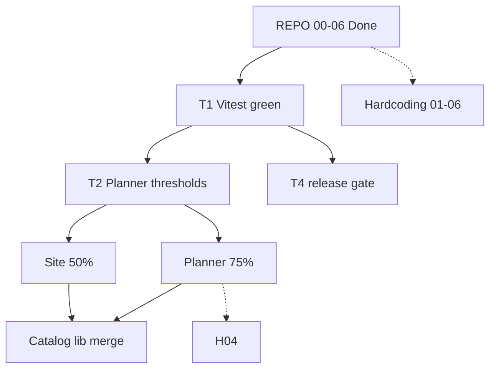

# Master program plan

*Last verified: 2026-06-15 · Canonical repo: `E:\Goodsites\13062026` · How-to: `docs/` · Execution detail: sibling plans below.*

## Charter

Ship **one unified planner** on **oando.co.in** with measurable quality: green gates, honest coverage, clean folder layout, and no silent hardcoding debt — before any catalog/lib structural merge.

**North-star metrics**

| Metric | Target | Now | Source |
|--------|--------|-----|--------|
| Vitest | 100% pass | **542/542** (75 files) | `npm run test` |
| Planner coverage | **≥ 75%** all metrics | **22.3%** stmts | `results/coverage-summary.json` → `features/planner` |
| Site-logic coverage | **≥ 50%** all metrics | **24.0%** stmts | same → `site` |
| Static build | **341** pages | **341** | `npm run build` |
| Repo layout steps 00–06 | Complete | **Done** | `plans/REPO-STRUCTURE-PLAN.md` |
| `release:gate` | Full green | Vitest in gate ✓ · Playwright needs env | `docs/Failures.md` |

---

## Initiative dashboard

| ID | Initiative | Plan | Status | Next action |
|----|------------|------|--------|-------------|
| **R** | Repository layout | [`REPO-STRUCTURE-PLAN.md`](REPO-STRUCTURE-PLAN.md) | **Complete** (00–06) | — |
| **T** | Testing & gates | [`TESTING-PLAN.md`](TESTING-PLAN.md) | **In progress** | T4.2–T4.4; Slice A finish |
| **C** | Coverage (2 tracks) | [`COVERAGE-PLAN.md`](COVERAGE-PLAN.md) | **In progress** | Planner → 75%; site → 50% |
| **P** | Planner coverage detail | [`PLANNER-COVERAGE-75.md`](PLANNER-COVERAGE-75.md) | Slice **A** ~70% done | A3 → hooks (B) |
| **S** | Site coverage detail | [`SITE-COVERAGE.md`](SITE-COVERAGE.md) | **S0 done** | S1 catalog + `data/site` |
| **H** | Hardcoding remediation | [`HARDCODING-PLAN.md`](HARDCODING-PLAN.md) | Steps **01–03** queued | H1 secrets ops |
| **A** | Archive crosswalk | [`ARCHIVE-MAP.md`](ARCHIVE-MAP.md) | Maintained | Update when plans change |

**Inventory of literals:** [`docs/HARDCODING-INVENTORY.md`](../docs/HARDCODING-INVENTORY.md)

---

## Dependency graph



**Rule:** No `lib/catalog` ↔ `features/catalog` merge until **P75 ≥ ~40%** and **S50 ≥ ~25%** (ratchet milestones in child plans).

---

## Critical path (next 3 PRs)

| Order | PR | Track | Deliverable | Proof |
|-------|-----|-------|-------------|-------|
| 1 | **P-PR-A3** | Planner | `aiStore`, `versionStore`, geometry/persistence gaps | `store/` ≥ 55% stmts; planner ~28%+ |
| 2 | **S-PR1** | Site | Extend `data/site` + `lib/catalog` tests | `scopes.site` ≥ 35% |
| 3 | **P-PR-B** | Planner | `hooks/` RTL harness (`usePlannerWorkspace` first) | `hooks/` ≥ 40% |

Parallel (low risk): **H-PR01** secrets hygiene · **H-PR02** seed script URL parse.

---

## Plan taxonomy

| Layer | Files | Use when |
|-------|-------|----------|
| **Program** | `MASTER-PLAN.md` (this file) | Prioritization, status, cross-initiative deps |
| **Strategy** | `COVERAGE-PLAN.md`, `TESTING-PLAN.md` | Policy, phases, gate wiring |
| **Execution** | `PLANNER-COVERAGE-75.md`, `SITE-COVERAGE.md`, `HARDCODING-PLAN.md`, `REPO-STRUCTURE-PLAN.md` | File-level slices, PR stacks, acceptance |
| **Reference** | `docs/TESTING.md`, `docs/SCRIPTS.md`, `docs/HARDCODING-INVENTORY.md` | Commands, layout, literal map |
| **Ops** | `docs/Handover.md`, `docs/Failures.md` | Live milestones & open breakages |

Do not duplicate command tables from `docs/TESTING.md` in plans — link instead.

---

## Release gate (target state)

```text
lint:secrets → lint → typecheck → test → build
  → test:a11y → test:e2e:nav → test:planner-catalog
  → test:coverage:planner   # @ 75% milestone
  → test:coverage:site      # @ 50% milestone
```

**Today:** `test` is in gate (T4.1 ✓). Coverage steps T4.2–T4.3 open. Full gate needs `.env.local` / `DATABASE_URL` for plan-route Playwright (`docs/Failures.md`).

---

## Risk register

| Risk | Impact | Mitigation | Owner plan |
|------|--------|------------|------------|
| Low planner % despite many tests | False confidence | Planner-only denominator; slices A–C | P |
| `* 10` unit drift | Wrong furniture sizes on reload | `HARDCODING` step 04 after Slice D tests | H |
| Site routes untested in Vitest | Coverage theater | Playwright smoke + site-logic scope only | S |
| Weak admin tokens | PII exposure | `HARDCODING` step 01 | H |
| Stale plan numbers | Wrong priorities | Re-verify after each coverage PR; run `docs:sync` | T0 |
| `proxy.ts` edit without 301 audit | Broken bookmarks | Step 06 only with approval | R / H |

---

## Definition of done (program)

- [ ] Planner `scopes.features.planner` ≥ **75%** (all metrics) + `vitest.config.ts` thresholds
- [ ] Site `scopes.site` ≥ **50%** (all metrics) + `vitest.site.config.ts` thresholds
- [ ] `release:gate` green with coverage steps wired
- [ ] `HARDCODING` steps **01–05** accepted (06 waived or merged)
- [ ] Catalog/lib merge gate lifted in `REPO-STRUCTURE-PLAN.md`
- [ ] `docs/Handover.md` M6 → **Done**

---

## Verify (program health)

```bash
npm.cmd run test
npm.cmd run test:coverage
npm.cmd run test:coverage:site
npm.cmd run docs:check
npm.cmd run test:layout:check
```

Refresh metrics: `npm.cmd run docs:sync:coverage` → commit `results/coverage-summary.json`.

---

## Changelog

| Date | Change |
|------|--------|
| 2026-06-15 | Created master plan; REPO 00–06 marked complete; dual coverage tracks; 542 tests / 22.3% planner |

---

## See also

- [`plans/CONTENTS.md`](CONTENTS.md) — file index
- [`docs/DOC-MAP.md`](../docs/DOC-MAP.md) — docs vs plans
- [`docs/Handover.md`](../docs/Handover.md) — tick milestones here