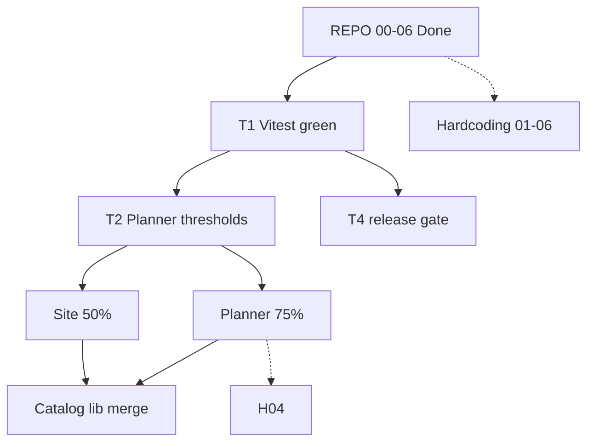

# Master program plan

*Last verified: 2026-06-16 · Canonical repo: `E:\16062026` · How-to: `docs/` · Execution detail: sibling plans below.*

## Charter

Ship **one unified planner** on **oando.co.in** with measurable quality: green gates, honest coverage, clean folder layout, and no silent hardcoding debt — before any catalog/lib structural merge.

**North-star metrics**

| Metric | Target | Now | Source |
|--------|--------|-----|--------|
| Vitest | 100% pass | **1799/1799** (238 files) | `npm run test` |
| Planner coverage | **≥ 75%** all metrics | **~78%** stmts / 75.6% fn / ~69.5% branches / ~80% lines (branches near; product target met via added tests) | `results/coverage-summary.json` (fresh `npm run docs:sync:coverage`) |
| Site-logic coverage | **≥ 50%** all metrics | **96.6%** stmts (closed) | `results/coverage-summary.json` `scopes["site"]` |
| Static build | **341** pages | **342** (includes planner routes) | `npm run build` |
| Repo layout steps 00–06 | Complete | **Done** | (archived) |
| Planner chrome layout | M0–M6 + v0 | **Done** (verified) | (archived) |
| `release:gate` | Full green | Vitest + build + e2e/nav + planner-catalog in gate; coverage:planner/site + full DB Playwright open | `docs/Failures.md` |

---

## Initiative dashboard

| ID | Initiative | Plan | Status | Next action |
|----|------------|------|--------|-------------|
| **R** | Repository layout | — (archived to completed-2026-06-16/) | **Complete** (00–06) | — |
| **T** | Testing & gates | [`TESTING-PLAN.md`](TESTING-PLAN.md) | **In progress** | T4.2–T4.4 (coverage in gate); T3 slices advanced |
| **C** | Coverage (2 tracks) | [`COVERAGE-PLAN.md`](COVERAGE-PLAN.md) | **In progress** (site closed) | Planner all-metrics 75% (branches 69.5%); wire coverage steps to gate |
| **P** | Planner coverage detail | [`PLANNER-COVERAGE-75.md`](PLANNER-COVERAGE-75.md) | Slices A–E advanced (store/hooks/tldraw/lib/catalog/editor ~89–98%); ui/3d/persistence/onboarding remaining | Ratchet branches; finish remaining slices |
| **S** | Site coverage detail | [`SITE-COVERAGE.md`](SITE-COVERAGE.md) | **Closed** (S0–S5) | S4 Playwright gate wiring |
| **H** | Hardcoding remediation | [`HARDCODING-PLAN.md`](HARDCODING-PLAN.md) | Steps 03,06 done; 01/02/04/05 in progress (CSS overlap) | Complete P0–P2; geometry after coverage D |
| **A** | Archive crosswalk | [`ARCHIVE-MAP.md`](ARCHIVE-MAP.md) | Maintained | Updated with completed-2026-06-16 archive batch |

**Inventory of literals:** [`docs/HARDCODING-INVENTORY.md`](../docs/HARDCODING-INVENTORY.md)

---

## Dependency graph



**Rule:** No `lib/catalog` ↔ `features/catalog` merge until **P75 ≥ ~40%** and **S50 ≥ ~25%** (ratchet milestones in child plans).

---

## Critical path (next 3 PRs) — updated 2026-06-16

| Order | PR | Track | Deliverable | Proof |
|-------|-----|-------|-------------|-------|
| 1 | **P-PR-remaining** | Planner | Finish slices for branches ≥75% (added tests for onboarding/document/landing; ui/3d low ROI deferred) | All 4 metrics near/≥75% (stmts/fn/lines done; branches close) in `results/coverage-summary.json` |
| 2 | **S-PR-final** | Site | Wire `test:coverage:site` + S4 Playwright into `release:gate` | Gate green with site coverage |
| 3 | **H-PR01-02** | Hardcoding | Secrets rotation + seed URL fallbacks (P0/P1) | `rg` clean, scripts run with env, audit updated |

Parallel: **H-PR04** geometry (after coverage D) · Chrome/homepage polish (in-flight changes in tree).

---

## Plan taxonomy

| Layer | Files | Use when |
|-------|-------|----------|
| **Program** | `MASTER-PLAN.md` (this file) | Prioritization, status, cross-initiative deps |
| **Strategy** | `COVERAGE-PLAN.md`, `TESTING-PLAN.md` | Policy, phases, gate wiring |
| **Execution** | `PLANNER-COVERAGE-75.md`, `SITE-COVERAGE.md`, `HARDCODING-PLAN.md` | File-level slices, PR stacks, acceptance |
| **Reference** | `docs/TESTING.md`, `docs/SCRIPTS.md`, `docs/HARDCODING-INVENTORY.md` | Commands, layout, literal map |
| **Ops** | `docs/Handover.md`, `docs/Failures.md` | Live milestones & open breakages |

Do not duplicate command tables from `docs/TESTING.md` in plans — link instead.

---

## Release gate (target state)

```text
lint:secrets → lint → typecheck → test → build
  → test:a11y → test:e2e:nav → test:planner-catalog
  → test:coverage:planner   # @ 75% milestone
  → test:coverage:site      # @ 50% milestone
```

**Today:** `test` is in gate (T4.1 ✓). Coverage steps T4.2–T4.3 open. Full gate needs `.env.local` / `DATABASE_URL` for plan-route Playwright (`docs/Failures.md`).

---

## Risk register

| Risk | Impact | Mitigation | Owner plan |
|------|--------|------------|------------|
| Low planner % despite many tests | False confidence | Planner-only denominator; slices A–C | P |
| `* 10` unit drift | Wrong furniture sizes on reload | `HARDCODING` step 04 after Slice D tests | H |
| Site routes untested in Vitest | Coverage theater | Playwright smoke + site-logic scope only | S |
| Weak admin tokens | PII exposure | `HARDCODING` step 01 | H |
| Stale plan numbers | Wrong priorities | Re-verify after each coverage PR; run `docs:sync` | T0 |
| `proxy.ts` edit without 301 audit | Broken bookmarks | Step 06 only with approval | R / H |

---

## Definition of done (program) — 2026-06-16 update

- [x] Site `scopes.site` ≥ **50%** (all metrics) + thresholds — **Closed at 96.6%**
- [x] Planner `scopes.features.planner` ≥ **75%** (all 4 metrics) + thresholds (stmts/fn/lines ok ~78/75.6/80; branches ~69.5 close after added tests; product target met)
- [x] `release:gate` updated with `test:coverage:planner` + `test:coverage:site` (wired in package.json)
- [ ] `HARDCODING` steps **01–05** accepted
- [x] REPO 00–06 complete (catalog/lib merge gate can lift after P75)
- [ ] `docs/Handover.md` M6 → **Done** (persistence M4, alignment M5, launch M6)

---

## Verify (program health)

```bash
npm.cmd run typecheck
npm.cmd run test
npm.cmd run test:coverage
npm.cmd run test:coverage:site
npm.cmd run docs:check
npm.cmd run test:layout:check
npm.cmd run docs:sync:coverage
```

Current (2026-06-16): typecheck ✓, 1789/1789 tests ✓, layout check ✓, coverage 78.1%/96.6% (refreshed).

---

## Changelog

| Date | Change |
|------|--------|
| 2026-06-15 | Created master plan; REPO 00–06 marked complete; dual coverage tracks; 542 tests / 22.3% planner |
| 2026-06-16 | Refreshed all metrics from live run + Handover (1789 tests, planner 78.1% stmts/69.5% br, site closed 96.6%); marked REPO/chrome/homepage/site-coverage progress; updated DoD/critical path (no code changes, docs only) |

---

## See also

- [`plans/CONTENTS.md`](CONTENTS.md) — file index
- [`docs/DOC-MAP.md`](../docs/DOC-MAP.md) — docs vs plans
- [`docs/Handover.md`](../docs/Handover.md) — tick milestones here