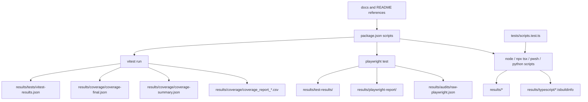

# Script Usage Report

Generated from the current repo state on 2026-06-22.

## What I checked

- `package.json` script entries
- direct script calls from tests
- script references in docs and README files
- configured output paths in Vitest and Playwright
- generated artifacts under `results/`

## How scripts are being used

### 1. Day-to-day app commands

These are the main human-facing entrypoints:

- `dev`, `dev:turbo`, `build`, `start`
- `lint`, `typecheck`, `test`
- `release:gate`, which chains lint, typecheck, tests, build, and e2e checks

### 2. Test and report commands

These commands are the ones producing the artifacts you were asking about:

- `test:coverage` runs Vitest coverage and then `scripts/generate-coverage-report.mjs`
- `test:coverage:site` runs the site-scoped Vitest config
- `test:results` chains both coverage commands
- `test:e2e:nav`, `test:a11y`, and `test:planner-catalog` run Playwright suites

### 3. Maintenance / ops commands

These are used for catalog, database, assets, and recovery workflows:

- `catalog:*`
- `db:*`
- `supabase:*`
- `assets:*`
- `audit:*`
- `launch:*`
- `recovery:*`
- `scan:secrets`
- `project:render`
- `tree:*`

## Actual usage evidence

- `tests/scripts.test.ts` directly executes `scripts/audit-test-quality.ts` and `scripts/generate-coverage-report.mjs`
- `docs/OPERATIONS_RUNBOOK.md`, `docs/ONBOARDING.md`, and `docs/architecture/DEPLOYMENT.md` reference the main verification commands
- `config/build/playwright.config.ts` defines the Playwright output paths
- `scripts/generate-coverage-summary.mjs` and `scripts/refresh-coverage-summary-from-json.mjs` read coverage data from `results/coverage` and `results/coverage-site`
- `scripts/generate-docs.mjs` consumes the generated inventory and coverage summary files
- `app/(site)/results/page.tsx` reads the live `results/` tree and exposes it as a mini site

## Output map

## What was confusing

- `test:coverage:planner` is currently the same command as `test:coverage`
- `seed` and `seed:direct` are the same command
- `test:features` is the same as `test`
- older coverage and temp folders existed outside the current `results/` convention
- TypeScript build info had been landing under `config/build/`; the current config now points build info at `results/typescript/`

## Current routing

- Vitest coverage is routed to `results/coverage`
- Playwright test output is routed to `results/test-results`
- Playwright HTML reporting is routed to `results/playwright-report`
- Playwright JSON reporting is routed to `results/audits/raw-playwright.json`
- the coverage CSV generator reads and writes inside `results/coverage`
- TypeScript build info is configured to go to `results/typescript/`
- the `/results` page scans the live `results/` tree and groups it by top-level folder
- the script test uses a real OS temp directory so it does not pollute the repo

## Verification

- `npx vitest run tests/root-configs.test.ts tests/scripts.test.ts --coverage` passed
- the run wrote `results/tests/vitest-results.json`
- the run wrote coverage artifacts under `results/coverage/`

## Follow-up

- `test:coverage:planner` should be renamed or documented more clearly if you want the script names to match behavior exactly
- stale historical artifacts under `coverage/`, `test-results/`, and old temp folders can be archived if you want a cleaner root
- `config/build/tsconfig.features.tsbuildinfo` is a historical artifact; the live TypeScript build-info target is `results/typescript/features.tsbuildinfo`
